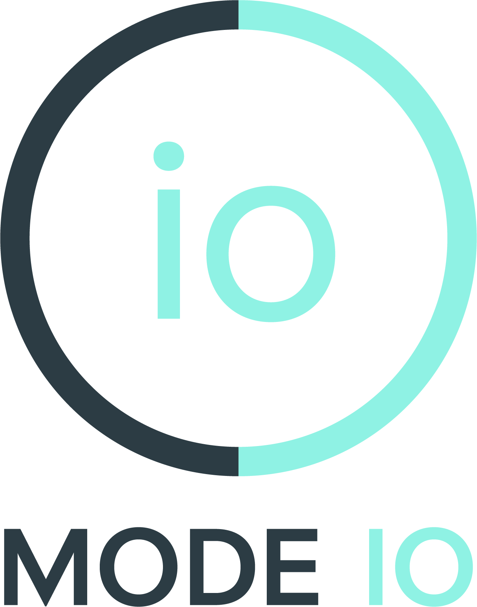

<div align="center">

<p align="center">
  <picture>
    
  </picture>
</p>

# Mode IO Skills

Source repository for Mode IO's privacy, safety, repository-audit, and middleware-routing skills for AI agents.

<p align="center">
  <a href="https://www.modeio.ai/">
    
  </a>
  <a href="https://github.com/mode-io/mode-io-skills">
    
  </a>
  <a href="https://github.com/mode-io/mode-io-skills/blob/main/LICENSE">
    
  </a>
  
</p>

</div>

## Overview

`mode-io-skills` is a centralized source repo with four distinct skill boundaries:

| Skill | Use it for | Runtime model |
|---|---|---|
| [`privacy-protector`](./privacy-protector/) | PII anonymization, deanonymization, file workflows, local detector tuning | `lite` is local-only; higher levels call the backend API |
| [`security`](./security/) | Pre-execution safety checks for risky or state-changing instructions | Backend-backed live check |
| [`skill-audit`](./skill-audit/) | Deterministic pre-install repository safety audit for third-party skills and plugins | Static analysis only |
| [`modeio-middleware`](./modeio-middleware/) | Thin skill wrapper for the standalone gateway product | Docs-only wrapper to the standalone repo |

The repo root is intentionally catalog-only. There is no repo-root bootstrap, shared `requirements.txt`, or shared `.env` template anymore.

## What Is Current

- Public skill names are now `privacy-protector`, `security`, and `skill-audit`.
- Each top-level skill folder is the publish/install unit for ClawHub.
- `modeio-middleware` in this repo is intentionally a thin wrapper; the runtime, tests, and product implementation live in [`mode-io-middleware`](https://github.com/mode-io/mode-io-middleware).
- ClawHub-facing metadata is carried in each skill's `SKILL.md`.
- Maintainer-only tests, smoke helpers, and benchmark assets are excluded from ClawHub uploads via per-skill `.clawhubignore`.

## Highlights

### `privacy-protector`

- Supports local regex masking with `--level lite`.
- Supports API-backed `dynamic`, `strict`, and `crossborder` analysis.
- Supports text-like files plus `.docx` and `.pdf` for anonymization.
- Supports local deanonymization through persisted map files.

```bash
cd privacy-protector
python3 scripts/anonymize.py \
  --input "Email: alice@example.com, Phone: 415-555-1234" \
  --level lite \
  --json
```

### `security`

- Designed for live instruction gating before tool execution or state changes.
- Expects structured context for mutating work.
- Returns stable JSON envelopes for both success and failure.

```bash
cd security
python3 -m pip install requests
python3 scripts/safety.py \
  -i "DROP TABLE users" \
  -c '{"environment":"production","operation_intent":"destructive","scope":"broad","data_sensitivity":"regulated","rollback":"none","change_control":"ticket:DB-9021"}' \
  -t "postgres://prod/maindb.users" \
  --json
```

### `skill-audit`

- Deterministic static audit only: it does not install dependencies or execute target-repo code.
- Primary commands are `evaluate`, `prompt`, `validate`, and `adjudicate`.
- Deliberately skips target-repo `tests/` and fixture paths so results stay focused on installable runtime surfaces.

```bash
cd skill-audit
python3 scripts/skill_safety_assessment.py evaluate \
  --target-repo /path/to/repo \
  --json > /tmp/skill_scan.json
```

### `modeio-middleware`

- Teaches agents how to install, start, verify, and monitor the standalone gateway.
- Points operators to the dashboard and monitoring APIs in the standalone product.
- Does not bundle middleware runtime code in this repo.

```bash
python3 -m pip install git+https://github.com/mode-io/mode-io-middleware
modeio-middleware-setup --health-check
```

## Repository Layout

```text
mode-io-skills/
  README.md
  privacy-protector/
  security/
  skill-audit/
  modeio-middleware/
```

Each skill folder contains its own:

- `SKILL.md`
- `LICENSE`
- `NOTICE`
- references and examples relevant to that skill

## Work From Source

Use the individual skill folder as the working directory.

### `privacy-protector`

```bash
cd privacy-protector
python3 scripts/anonymize.py --input "Email: alice@example.com" --level lite --json
python3 scripts/deanonymize.py --input "Email: [EMAIL_1]" --map ~/.modeio/redact/maps/<map-id>.json --json
python3 scripts/detect_local.py --input "Reach support@example.com" --json
```

### `security`

```bash
cd security
python3 -m pip install requests
python3 scripts/safety.py --help
```

### `skill-audit`

```bash
cd skill-audit
python3 scripts/skill_safety_assessment.py evaluate --target-repo /path/to/repo --json
python3 scripts/skill_safety_assessment.py prompt --target-repo /path/to/repo --scan-file /tmp/skill_scan.json
python3 scripts/skill_safety_assessment.py validate --scan-file /tmp/skill_scan.json --assessment-file /tmp/assessment.md --json
```

### `modeio-middleware`

Use the standalone product repo for runtime install, gateway startup, monitoring, plugin development, and product-level tests:

- [`mode-io-middleware`](https://github.com/mode-io/mode-io-middleware)
- [`QUICKSTART.md`](https://github.com/mode-io/mode-io-middleware/blob/main/QUICKSTART.md)
- [`ARCHITECTURE.md`](https://github.com/mode-io/mode-io-middleware/blob/main/ARCHITECTURE.md)
- [`MODEIO_PLUGIN_PROTOCOL.md`](https://github.com/mode-io/mode-io-middleware/blob/main/MODEIO_PLUGIN_PROTOCOL.md)

## ClawHub Notes

- This repository is centralized, but ClawHub publishes per skill folder, not per repo root.
- The publishable units are:
  - `privacy-protector/`
  - `security/`
  - `skill-audit/`
  - `modeio-middleware/`
- The repo root is not a single installable skill.
- Once a skill is listed in ClawHub, the current OpenClaw install flow is `clawhub install <skill-slug>`.

If you prefer the older repo-path install workflow, keep `npx skills add` as an alternative:

```bash
# Claude Code
npx skills add mode-io/mode-io-skills --skill privacy-protector --agent claude-code --yes --copy
npx skills add mode-io/mode-io-skills --skill security --agent claude-code --yes --copy
npx skills add mode-io/mode-io-skills --skill skill-audit --agent claude-code --yes --copy
npx skills add mode-io/mode-io-skills --skill modeio-middleware --agent claude-code --yes --copy

# Codex CLI
npx skills add mode-io/mode-io-skills --skill privacy-protector --agent codex --yes --copy
npx skills add mode-io/mode-io-skills --skill security --agent codex --yes --copy
npx skills add mode-io/mode-io-skills --skill skill-audit --agent codex --yes --copy
npx skills add mode-io/mode-io-skills --skill modeio-middleware --agent codex --yes --copy

# OpenCode
npx skills add mode-io/mode-io-skills --skill privacy-protector --agent opencode --yes --copy
npx skills add mode-io/mode-io-skills --skill security --agent opencode --yes --copy
npx skills add mode-io/mode-io-skills --skill skill-audit --agent opencode --yes --copy
npx skills add mode-io/mode-io-skills --skill modeio-middleware --agent opencode --yes --copy
```

For maintainers publishing from source:

```bash
clawhub publish /path/to/mode-io-skills/privacy-protector
clawhub publish /path/to/mode-io-skills/security
clawhub publish /path/to/mode-io-skills/skill-audit
clawhub publish /path/to/mode-io-skills/modeio-middleware
```

Then use sync for ongoing updates:

```bash
clawhub sync --root /path/to/mode-io-skills
```

## Maintainer Validation

Typical focused validation commands:

```bash
python3 -m unittest discover privacy-protector/tests -p 'test_*.py'
python3 -m unittest discover security/tests -p 'test_*.py'
python3 -m unittest discover skill-audit/tests -p 'test_*.py'
bash privacy-protector/scripts/smoke_redact.sh
python3 skill-audit/scripts/skill_safety_assessment.py evaluate --target-repo privacy-protector --json
```

These tests and maintainer helpers are not part of the ClawHub upload surface.

## Related Repos

- Website: [modeio.ai](https://www.modeio.ai/)
- Standalone middleware product: [mode-io/mode-io-middleware](https://github.com/mode-io/mode-io-middleware)

## License

This repository is licensed under Apache License 2.0. Each distributed skill folder also carries its own `LICENSE` and `NOTICE`.
